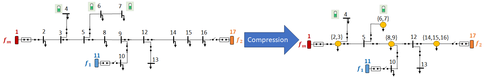
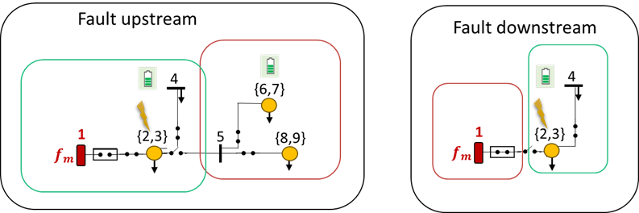
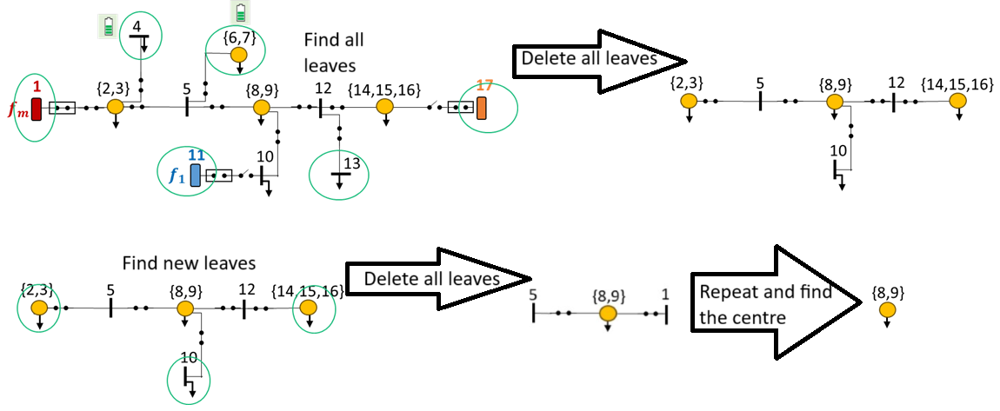
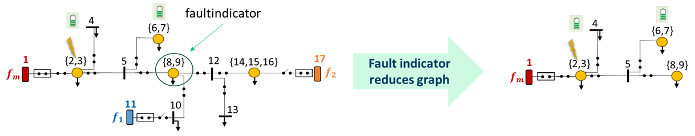
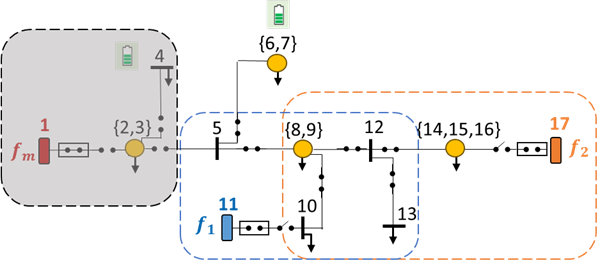
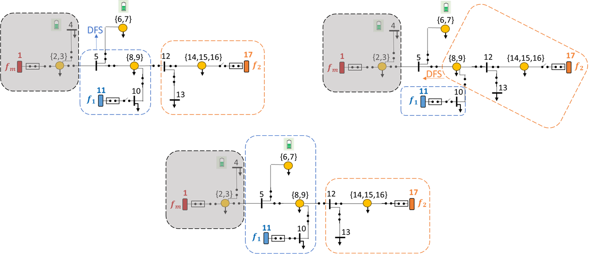

# Example of the RelDist method in use.
We will here explain how the method works on a simple example. 

## Graph compression
We will demonstrate the method using the network depicted in the figure below. Since most of our algorithms work better if there are switches on all edges, we deploy a compression algorithm that merges lines without switches. An example of the outcome of this algorithm is depicted below.

## Fault isolation
Faults are isolated by switches upstream and downstream of the faulted line. The fault isolation algorithm uses a binary search to find the faulted line. In the search the network is split in two at the centre of the graph (topological centre, could consider line lengths later). If the fault is upstream of the split we delete the downstream part of the graph, and if it is downstream we delete the part upstream. 

The algorithm for finding the centre iteratively deletes all leaves of the graph until only one or two vertices are left. An example is shown below:

Fault indicators are considered by deleting the part of the graph where the fault indicator says that the fault is not. An example of this is depicted in:

## Reconfiguration
After we have isolated a fault due to fault on line 2-3, we check which loads the reserve connections $f_1$ and $f_2$ can serve. This is done using a DFS starting from each of the reserve connections, that continues until it has seen more load than the capacity of the feeder. After these two DFS we may end up in a situation as depicted below:

We require that the network is operated radially. Therefore, we need to find a switch that splits the network between the two reserve connections $f_1$ and $f_2$. We do this by opening all switches in the area covered by the two first inital DFS. After opening a switch, one or both of the reserve connections may be able to serve more load and we do a DFS from all their leaf nodes, to see if we can serve more load. An example of this and the final best split is show below.

 
### Partitioning
A potential end result of the partitioning algorithm is presented in Fig.~\ref{fig:reconfiguration} where $P(\mathcal{R}, f_1) = V_1 = (5, \{6, 7\}, \{8, 9\}, 10, 12, 13, 11)$ and $P(\mathcal{R}, f_2) = V_2 = (5, \{8,9\}, 10, 12, 13, \{14, 15, 16\}, 17)$. For a set of vertices $V$ we define the function $p_l(V)$ that returns the total load in the the partion $V$.

### Overlap handling
In the examples presented in figures~\ref{fig:reconfiguration_9-12} and~\ref{fig:reconfiguration_9-10} only one of the reduced partitions happen to have a leaf node that also happens to be bus $5$ in both cases.
\begin{figure}
    \centering
    \includegraphics[width=0.5\textwidth]{figures/reconfiguration_9-12.png}
	\caption{Example of overlap algorithm after a fault on line $(2,3)$ and the switch $(\{8,9\},12)$ has been opened.}
    \label{fig:reconfiguration_9-12}
\end{figure}
\begin{figure}
    \centering
    \includegraphics[width=0.5\textwidth]{figures/reconfiguration_9-10.png}
	\caption{Example of overlap algorithm after a fault on line $(2,3)$ and the switch $(\{8,9\},10)$ has been opened.}
    \label{fig:reconfiguration_9-10}
\end{figure}
An example of an unsuccessful split is to open the switch $(12,13)$ depicted in Fig.~\ref{fig:reconfiguration}, since this will lead to both feeders $f_1$ and $f_2$ being in the same split. A successful split would be to open the switch $(\{8, 9\}, 12)$, in which case the buses $12$ and $13$ would be removed from $V_1$ potentially allowing $f_i$ to supply more load as depicted in Fig~\ref{fig:reconfiguration_9-12}. Opening the switch $(12, \{14,15,16\})$ would successfully split the network, but would not allow for anymore load to be connected. Finally, opening the switch $(\{8,9\},10)$ would also be a successful split, and would potentially allow $f_2$ to supply more load as depicted in Fig.~\ref{fig:reconfiguration_9-10}.

 If we go back to the examples presented in figures~\ref{fig:reconfiguration_9-12}-\ref{fig:reconfiguration_9-10} and assume that none of them have capacity to supply $\{6,7\}$ and that $\gamma$ is equal for both cases. We will calculate $\phi$ to be able to distinguish the two options. The calculation is given in TABLE~\ref{tab:phi} with some example data. With the example data used we see that opening the switch $(\{8,9\},12)$ is preferred.
\begin{table}[tb]
    \centering
    \begin{tabular}{c c c c c c c}\toprule
        switch & $|\mathcal{L}(V_1)|$ & $|\mathcal{L}(V_2)|$ & $p_s(V_1)$ & $p_s(V_2)$ & $\phi(V_1)$ & $\phi(V_2)$\\\midrule
        $(\{8,9\},12)$ & 1 & 0 & 1 & 3 & 1 & 0 \\
        $(\{8,9\},10)$ & 0 & 1 & 0 & 4 & 0 & 0 \\\bottomrule
    \end{tabular}
    \caption{Example of calculating $\phi$ for two different switches.}
    \label{tab:phi}
\end{table}

